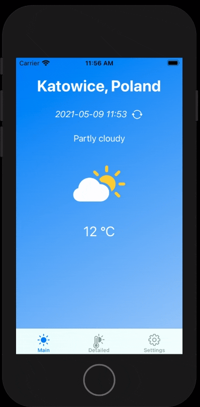

# :sun_behind_small_cloud: R_Pogodynka = R_WeatherApp

Simple Weather application wrote in SwiftUI base on Real-Time Weather API from 
> http://api.weatherstack.com/current?access_key=9a71c6a9950ded3d89c11b3c3091de2f&query=Katowice

## App runtime

### :sunny: Day View

### :new_moon: Night View

## :warning: Status
Still in development phase
